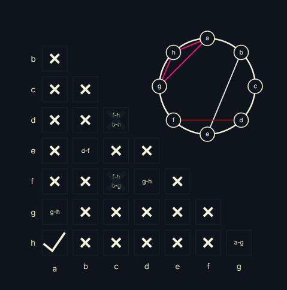
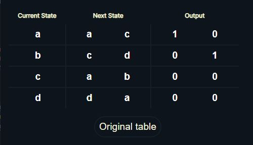

# Implication Table Reduction

Implication Tables are used in Digital Logic Design to reduce state table and remove redundent states

## Features

- **Reduced Table Generation:** Automatically generates implication tables based on the provided state table.
- **Interactive Chart:** Visualizes the state reduction process through an interactive and dynamic chart.
- **Equivalence Circles:** Helps to visulaize how many equivalent states can be grouped in an equivalence class.

## Screenshots

